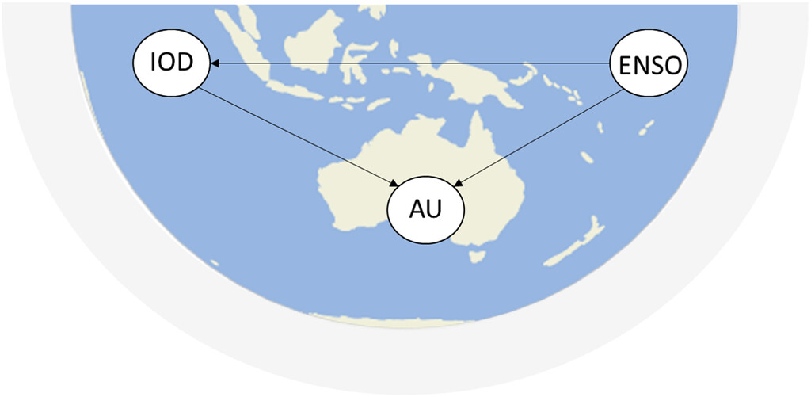

```{r setup, include=FALSE}
knitr::opts_chunk$set(echo = TRUE)
```

```{r}
## load the packages
library("pracma") ## we will use pracma::detrend to remove linear trends
library("stagedtrees")
```

We consider the problem and data of Example 5 in [Kretschmer et al. (2022)](https://journals.ametsoc.org/view/journals/bams/102/12/BAMS-D-20-0117.1.xml
). 

```
Kretschmer, M., Adams, S. V., Arribas, A., Prudden, R., Robinson, 
N., Saggioro, E., & Shepherd, T. G. (2021). 
Quantifying Causal Pathways of Teleconnections, 
Bulletin of the American Meteorological Society, 102(12), E2247-E2263. 
Retrieved Jul 14, 2022, from 
https://journals.ametsoc.org/view/journals/bams/102/12/BAMS-D-20-0117.1.xml
```
*ENSO is a key driver of Australian precipitation (AU) in austral spring (Maher and Sherwood 2014; Cai et al. 2011) and exhibits its influence on AU through various pathways (see also example 3). In particular, ENSO influences the IOD, another important driver of AU (Black et al. 2003).*

ENSO-IOD-AU hypothesized causal relationship (ENSO->IOD, ENSO->AU, IOD->AU) 
is shown in the figure.


## The data 

Data can be obtained from <https://github.com/informatics-lab/causality>
(the data originally is in `.nc` files, 
we provide here an aggregated `.csv` file).

```{r}
## load the data
data <- read.csv("data/data_enso_iod_au.csv")

## standardize
data <- scale(data)

## detrend 
data <- data.frame(detrend(data))

plot(data)
```


### Define Categorical Data

```{r}
data.categ = data.frame(
  au = cut(data$au, breaks = quantile(data$au, c(0,0.5,1)), 
           labels = c('low', 'high'), include.lowest = TRUE),
  enso = cut(data$enso, breaks = quantile(data$enso, seq(0,1,length.out = 4)), 
             labels = c('Nina', 'neut', 'Nino'), include.lowest = TRUE),
  iod = cut(data$iod, breaks = quantile(data$iod, seq(0,1,length.out = 4)), 
            labels = c('neg', 'zero', 'pos'), include.lowest = TRUE))

```


we now show the contingency table and we can check that it 
agrees with the table obtained by Kretschmer et al. (available [here](https://github.com/informatics-lab/causality/blob/master/causality_paper/notebooks/example5_nonlinear.ipynb))

```{r}
table(data.categ)
### ok! it agrees with the table obtained by Kretschmer et al.
```

## Model the data with staged trees 

We first, estimate a model with causal order `enso -> iod -> au`. 
We use the `stages_bhc` algorithm and the `AIC` score. 

```{r}
mod1 <- full(data.categ, order = c('enso', 'iod', 'au')) |> 
  stages_bhc(score = function(x) -AIC(x))
```

We can plot the staged tree and the conditional probabilitites of `au`:
```{r, fig.show="hold"}
par(mfrow=c(1,2))
plot(mod1)
barplot(mod1, var = "au")
```

In [Kretschmer et al. (2022)](https://journals.ametsoc.org/view/journals/bams/102/12/BAMS-D-20-0117.1.xml
) the following conclusions are obtained by analyzing the contingency table:

*We can see from this that the phase of IOD has barely any effect on AU for either La Niña or El Niño. For example, the Bayes factor for IOD+ during El Niño is 0.24/0.22 = 1.09, meaning that the probability of AU+ during El Niño phases is increased by only 9% if the IOD is positive. When ENSO is neutral there is a suggestion that IOD+ decreases the probability of AU+, while IOD− has a weaker positive effect.*

We can see that the staged tree analysis leads to similar conclusions.
In particular:

- `au` is independent of `iod` under the contexts `enso = Nino` and `enso = Nina`. 
- When `enso = neutral` we can see that `iod = pos` decrease the 
probability of `au = high` (see the barplot).

## Alternative Causal Order 

We now estimate a second model with causal order `iod -> enso -> au`:

```{r}
mod2 <- full(data.categ, order = c('iod', 'enso', 'au')) |> 
  stages_bhc(score = function(x) -AIC(x))
```

we plot model 1 and model 2 

```{r, fig.show='hold'}
par(mfrow=c(1,2))
plot(mod1, main = paste0("AIC=",format(AIC(mod1), digits = 5)))
plot(mod2, main = paste0("AIC=",format(AIC(mod2), digits = 5)))
```


